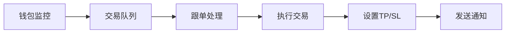
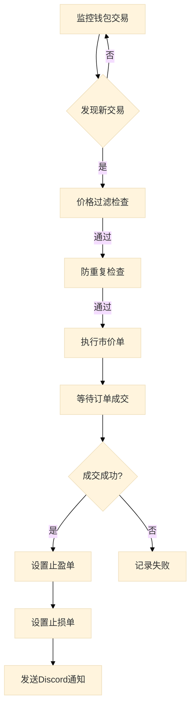

# Polymarket 跟单机器人

多钱包监控与自动跟单系统，用于 Polymarket 二元期权交易。

## 📋 功能特性

- **多钱包监控**：同时监控多个钱包的交易活动
- **自动跟单**：实时检测并自动执行跟单交易
- **价格过滤**：可配置价格区间过滤
- **止盈止损**：自动设置止盈和止损订单
- **Discord 通知**：交易成功后发送 Discord 通知
- **防重复跟单**：防止同一市场重复跟单

## 🏗️ 系统架构

```
poly_follow_bot/
├── main.py          # 程序主入口
├── monitor.py       # 钱包监控模块
├── trading.py       # 交易执行模块
├── notification.py  # Discord 通知模块
├── api.py           # Polymarket API 封装
├── cache.py         # 缓存管理模块
├── config.py        # 配置管理模块
└── config.json      # 配置文件
```

## 📊 系统性能



## 🚀 快速开始

### 1. 安装依赖

```bash
pip install -r requirements.txt
```

### 2. 配置环境

编辑 `config.json` 文件：

```json
{
    "wallets": ["钱包地址1", "钱包地址2"],
    "private_key": "你的私钥",
    "funder": "funder地址",
    "signature_type": 2,
    "poll_interval": 2,
    "discord_webhook_url": "你的webhook地址"
}
```

### 3. 运行程序

```bash
python main.py
```

## ⚙️ 配置说明

### 价格过滤
```json
"price_filter": {
    "enabled": true,
    "min_price": 0.3,
    "max_price": 0.85
}
```

### 防重复跟单
```json
"no_duplicate": {
    "enabled": true,
    "expire_seconds": 3600
}
```

### 止盈设置
```json
"tp": {
    "enabled": false,
    "type": "price",
    "value": 0.99
}
```

### 止损设置
```json
"sl": {
    "enabled": false,
    "type": "percent",
    "value": 0.5
}
```

## 📈 工作流程



## 🔒 安全提示

- **私钥安全**：请勿将 `config.json` 提交到公共仓库
- **API Key**：确保私钥有足够的 Polygon 网络 Gas 费
- **测试优先**：建议先在测试网验证策略

## 📝 日志输出

```
[10:30:15] [0x1234...5678] 发现 2 条新交易!
[10:30:16] [0x1234...5678] transactionHash: 0xabc...
[10:30:16] [0x1234...5678] token_id: 0xdef...
[10:30:16] [0x1234...5678] side: YES
[10:30:16] [0x1234...5678] size: 10, price: 0.45
[跟单线程] 下单成功: 订单ID: 12345
[通知] Discord 通知发送成功
```

## 🤝 贡献

欢迎提交 Issue 和 Pull Request！

## 📄 许可证

MIT License

## 📧 联系方式

- Email: ibook@outlook.be
- WeChat: IBO0OK
